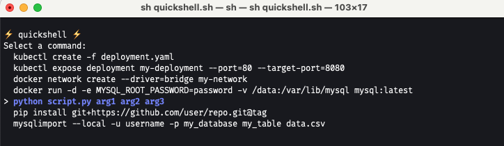

# ⚡️ quickshell ⚡️

Fast select day-to-day commands, because ⏰ is 💰!

<p align="center">
  
</p>

## Getting started

Your frequent commands should be in `~/.quickshell`

```sh
# create a link to script
chmod +x bin/quickshell
ln -sf $PWD/bin/quickshell /usr/local/bin/quickshell

# setup your commands
mv .quickshell ~/.quickshell
echo "echo \"my nice command\"" > ~/.quickshell
echo "echo \"my other nice command\"" > ~/.quickshell

# run and have fun
quickshell
```

## Build for release

```sh
shc -f quickshell.sh -o bin/quickshell
```

## Uninstall

```sh
rm -rf /usr/local/bin/quickshell
rm ~/.quickshell
```